# Features Supported by RARS

<!-- 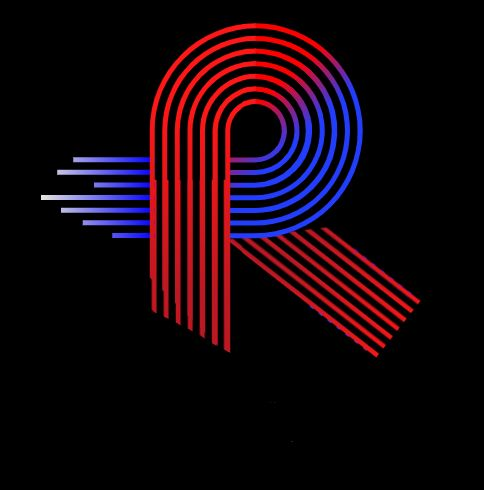 -->

RARS is a PDF viewer built in Flutter. Unlike a normal PDF viewer, RARS supports switching tabs so that the user can read multiple books without switching windows again and again. 

## Current features :  
- Mutiple PDFs support: The user can read multiple PDFs at one time without changing windows. Just open the PDFs and click on the tab of the PDF you want to read.

- Multiple Bookmarks addition: It also provides support to add multiple bookmarks so you can always switch to the part of the pdf which you found interesting. Oh, and this doesn't have any limit. Add as many bookmarks as you like. Maybe bookmark every page of the PDF and it will be saved in a scrollable bookmark bar. 

- Retaining the last page read: Whenever you open a book, you will get an option to "start from where you left off" or "start from the beginning". If it's a PDF you recently added on your shelf of PDFs, then it will start from the beginning, till u leave it off!

- Jump to a page: RARS provides the feature to jump to a specific page if the user wants to start reading from a specific page number. Easy and convinient.  

- Change theme color of book: Creative much? Change theme color of the book page to your liking. 

- Search in your shelf: Added 50 PDFS in your shelf? Search for the PDF you want to read in the search box to find it.

- Responsive: Adjusts to the various screen sizes. 

## Features yet to be added :
- Closing a tab
- Linking the search bar to libgen.org for the user to get instant PDF
- Adding support for EPUB files
- Adding support for Linux

## License

GPL3 

**Free software, hell yeah!**

## Images from the application: 

- Empty Shelf

  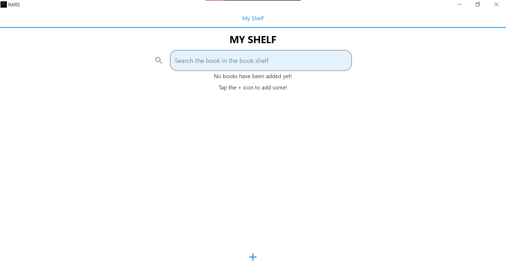

- Shelf after adding books

  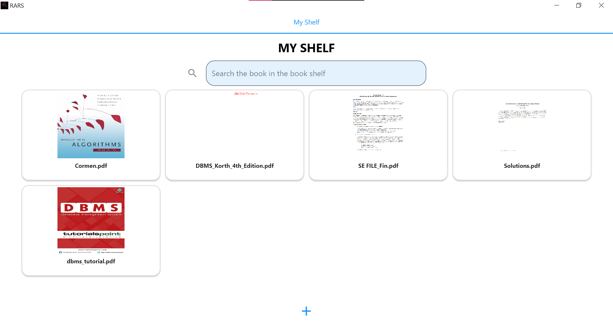

- Multiple PDF support i.e Tabs 
  
  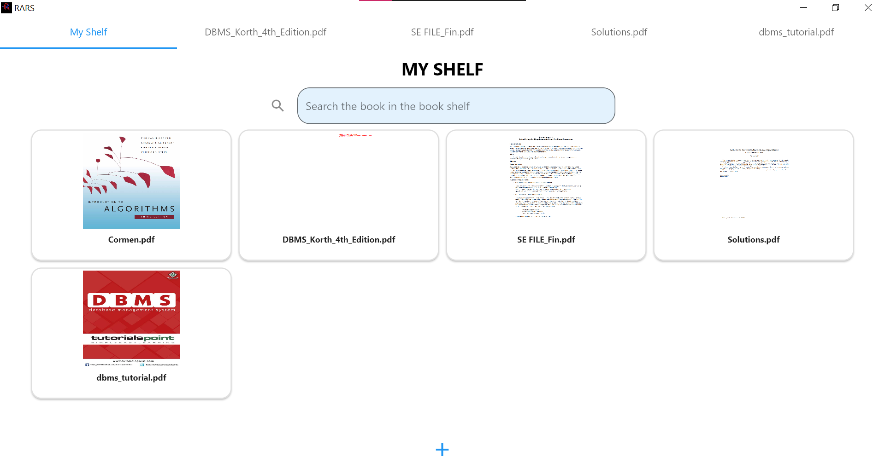
  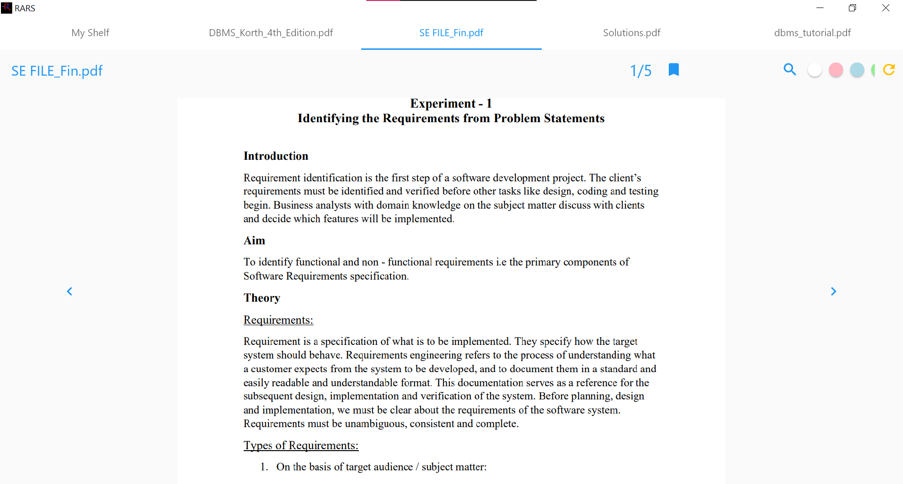

- Bookmarks 

  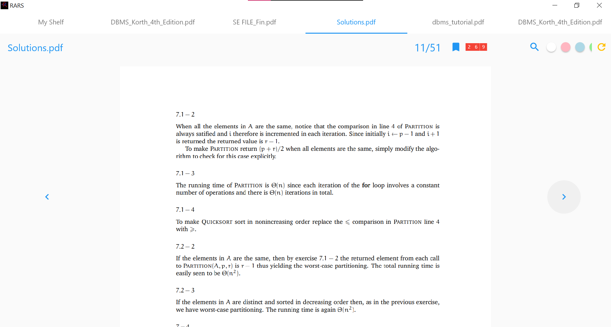
  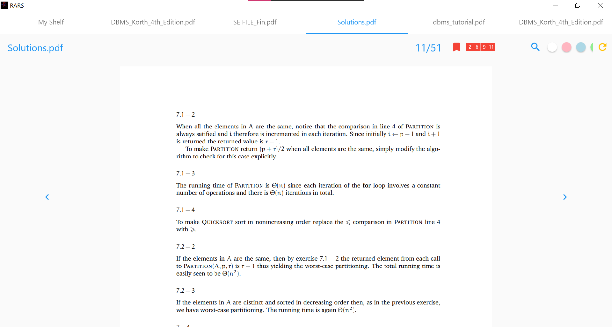

- Where to start reading the book from? 

  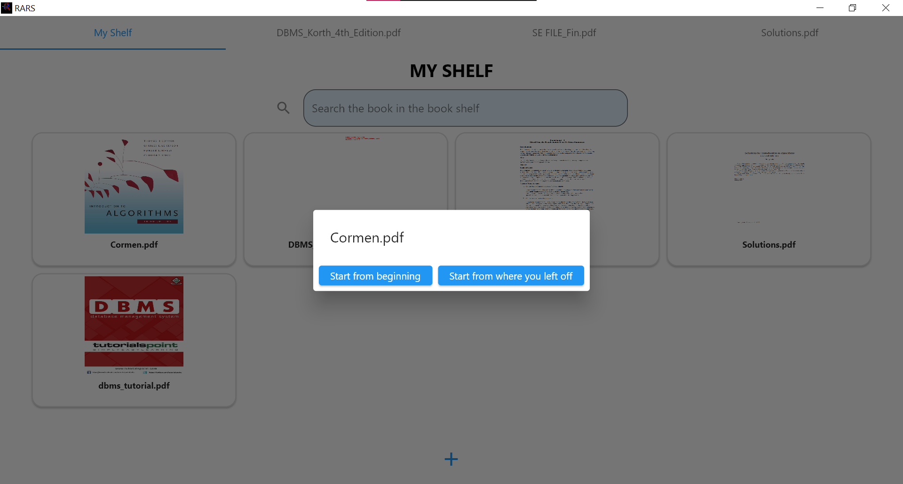

- Jump to a page
    
   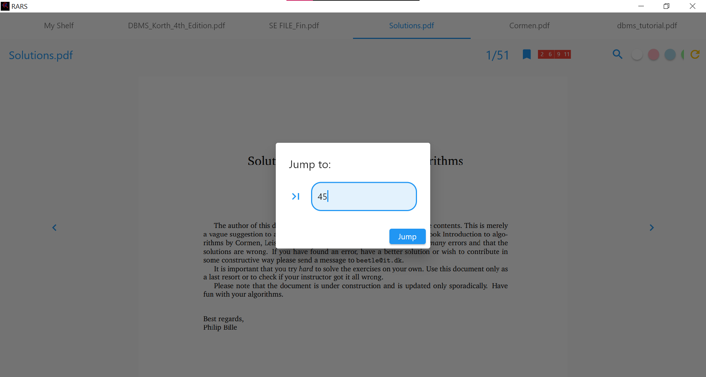

- Change theme colors

    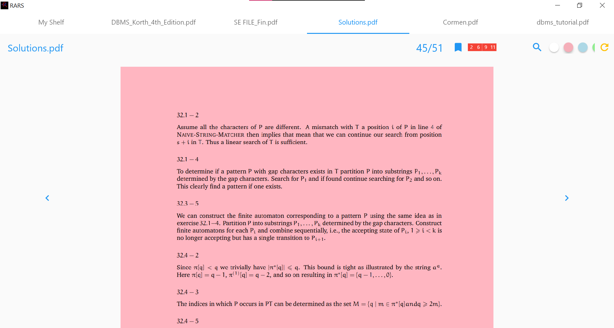
    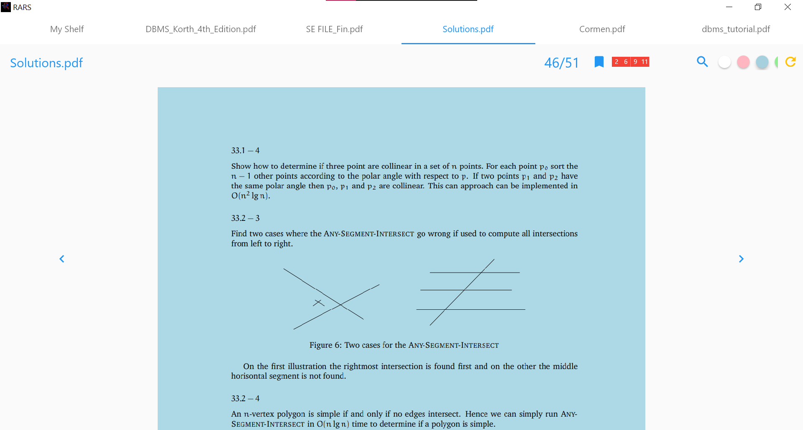
    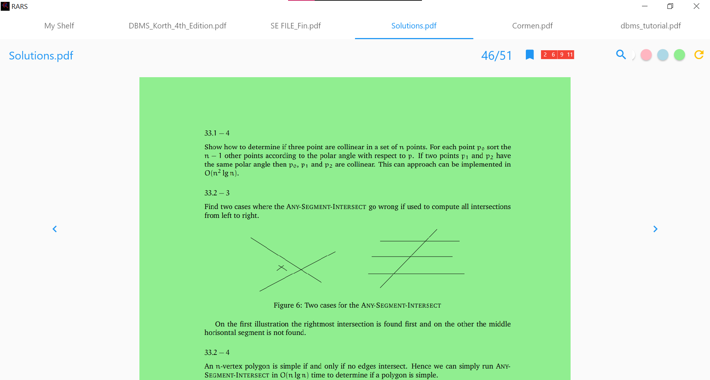

- Search in the shelf 

    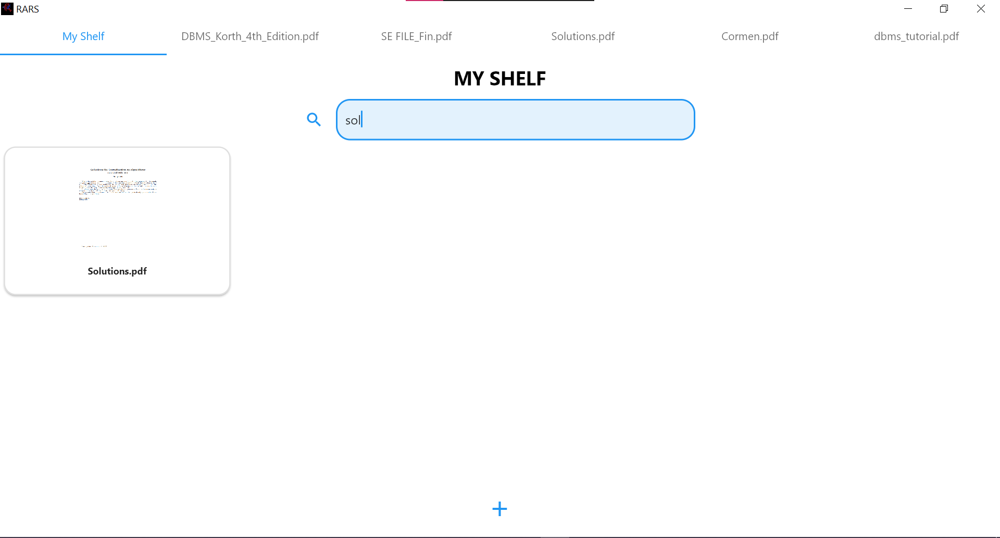

- Screen size responsiveness

    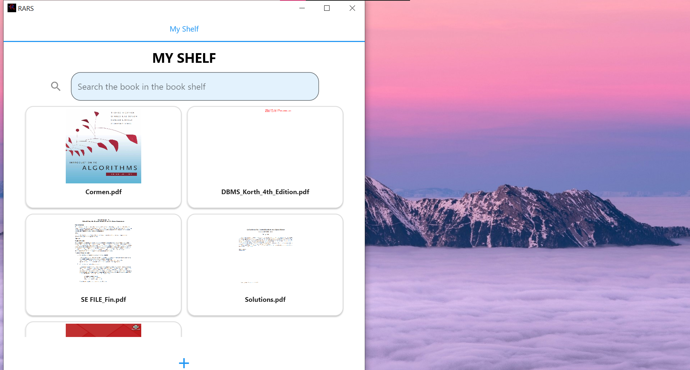
    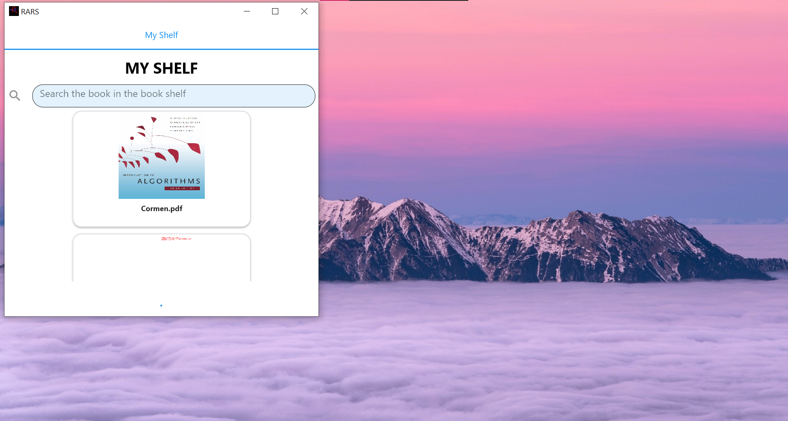

    

